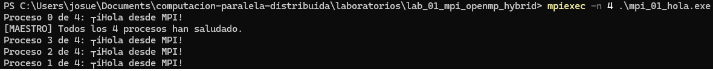
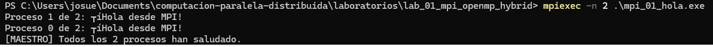
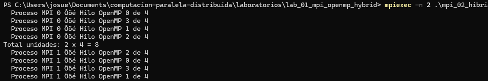
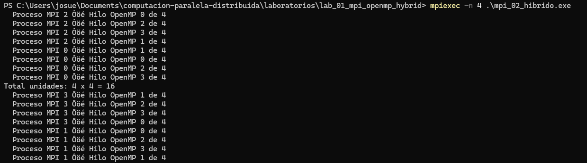
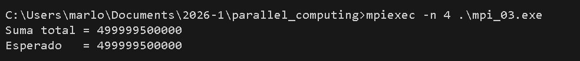
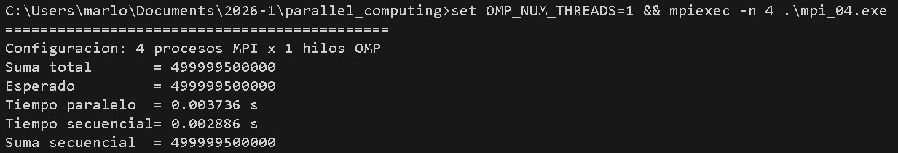
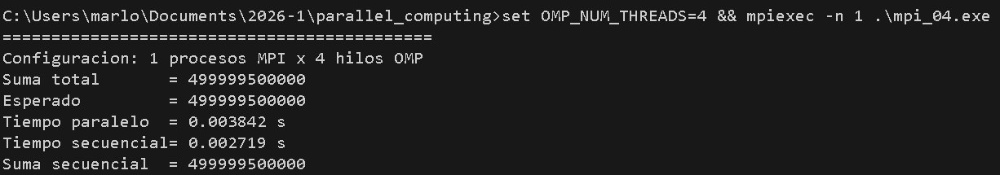
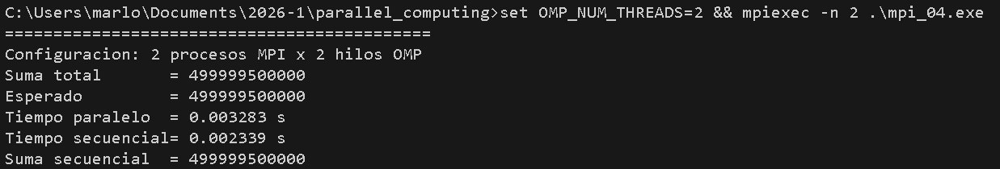
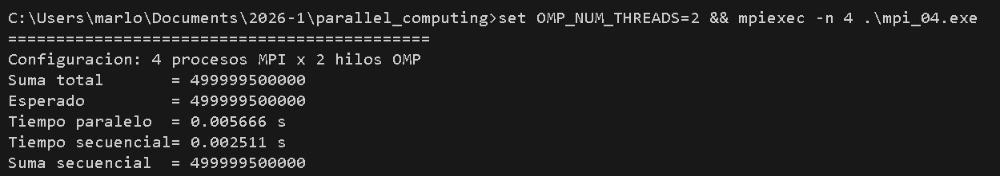

# Lab 01 — MPI + OpenMP Híbrido | Josué Natanael Reyes & Marlon Arévalo

> **Asignatura:** Fundamentos de Programación Concurrente y Distribuida
> **Docente:** Prf. Alejandro Jaimes
> **Fecha:** 17/05/2026

---

## Equipo

|     | Colaborador             | GitHub                                      |
| --- | ----------------------- | ------------------------------------------- |
| 👤  | Josué Natanael Reyes    | [Natanael-28](https://github.com/Natanael-28)  |
| 👤  | Marlon Arévalo          | [mrln137](https://github.com/mrln137)  |

---

## Cómo compilar y ejecutar (resumen)

```powershell
# Ejercicio 1 (solo MPI)
mpicc mpi_01_hola.c -o mpi_01_hola.exe
mpiexec -n 4 .\mpi_01_hola.exe
mpiexec -n 2 .\mpi_01_hola.exe

# Ejercicios 2, 3 y 4 (MPI + OpenMP)
mpicc -fopenmp mpi_02_hibrido.c     -o mpi_02_hibrido.exe
mpicc -fopenmp mpi_03_suma_hibrida.c -o mpi_03.exe
mpicc -fopenmp mpi_04_speedup.c      -o mpi_04.exe
```

---

## Ejercicio 1 — Hola Mundo MPI

**Descripción:** Cada proceso MPI imprime su `rank` y el total de procesos (`size`). El proceso maestro (`rank == 0`) imprime un mensaje adicional al finalizar.

**Compilación y ejecución:**
```powershell
mpicc mpi_01_hola.c -o mpi_01_hola.exe
mpiexec -n 4 .\mpi_01_hola.exe
mpiexec -n 2 .\mpi_01_hola.exe
```

**Pantallazo — 4 procesos:**



**Pantallazo — 2 procesos:**



### Respuestas a las preguntas de análisis

**1. ¿Por qué el orden de salida varía entre ejecuciones?**

Porque los procesos MPI se ejecutan de forma **independiente y concurrente**, cada uno con su propia memoria y su propio flujo de ejecución. El sistema operativo decide en qué momento cada proceso obtiene CPU para ejecutar su `printf`, y esa planificación cambia entre ejecuciones. Además, la salida estándar (stdout) se mezcla por línea entre procesos, por lo que aunque los `printf` se hayan iniciado en cierto orden, lo que vemos en pantalla refleja el orden en que cada proceso terminó de escribir. **MPI no garantiza ningún orden** en las salidas de procesos distintos: solo garantiza el orden dentro de un mismo proceso.

**2. ¿Qué pasaría si ejecutas con `-n 1`? ¿Tiene sentido paralelizar así?**

Con `-n 1` se lanza un único proceso MPI. La salida sería:
```
Proceso 0 de 1: ¡Hola desde MPI!
[MAESTRO] Todos los 1 procesos han saludado.
```
Funciona correctamente, pero **no tiene sentido como paralelización** porque no hay distribución de trabajo: solo se paga el costo de inicializar y finalizar MPI sin ganancia alguna. Es útil únicamente como caso de prueba o "línea base" para comparar el rendimiento secuencial contra versiones paralelas (como hacemos en el Ejercicio 4).

**3. ¿Para qué sirve `MPI_COMM_WORLD`? ¿Podría haber otros comunicadores?**

`MPI_COMM_WORLD` es el **comunicador por defecto** que agrupa a TODOS los procesos lanzados por `mpiexec`. Cada proceso tiene un `rank` único dentro de ese grupo. Sí pueden existir otros comunicadores: con funciones como `MPI_Comm_split` o `MPI_Comm_create` se pueden crear sub-grupos para que solo ciertos procesos se comuniquen entre sí. Por ejemplo, en un programa con 8 procesos podríamos crear un comunicador con los rangos pares y otro con los impares, y hacer reducciones independientes en cada uno. Esto es muy útil en algoritmos jerárquicos o cuando hay roles diferenciados.

---

## Ejercicio 2 — OpenMP dentro de MPI

**Descripción:** Dentro de cada proceso MPI se lanza una región paralela OpenMP con 4 hilos. Cada hilo imprime su ID junto con el `rank` del proceso al que pertenece. El maestro reporta el total de unidades de cómputo.

**Compilación y ejecución:**
```powershell
mpicc -fopenmp mpi_02_hibrido.c -o mpi_02_hibrido.exe
mpiexec -n 2 .\mpi_02_hibrido.exe
mpiexec -n 4 .\mpi_02_hibrido.exe
```

**Pantallazo — 2 procesos MPI × 4 hilos (8 unidades):**



**Pantallazo — 4 procesos MPI × 4 hilos (16 unidades):**



### Respuestas a las preguntas de análisis

**1. Con 2 procesos MPI y 4 hilos OMP, ¿cuántas unidades de cómputo hay?**

Hay **8 unidades de cómputo** (2 procesos × 4 hilos = 8). Cada proceso MPI corre en su propio espacio de memoria y dentro de él OpenMP crea 4 hilos que comparten esa memoria. Por eso vemos 8 líneas `Proceso MPI X │ Hilo OpenMP Y` en la salida.

**2. ¿En qué se diferencia ejecutar con `-n 4` (4 MPI, 4 hilos) vs `-n 1` (1 MPI, 16 hilos)?**

Aunque ambas configuraciones dan **16 unidades totales**, son fundamentalmente distintas:

- **`-n 4` con 4 hilos cada uno:** memoria distribuida entre los 4 procesos. Cada proceso tiene su propia copia de las variables; para compartir información hay que usar `MPI_Send`, `MPI_Scatter`, `MPI_Reduce`, etc. (paso de mensajes). Escala mejor a múltiples nodos físicos.
- **`-n 1` con 16 hilos:** todo en un solo proceso, memoria compartida. Los 16 hilos ven las mismas variables y se sincronizan con primitivas OpenMP (`critical`, `atomic`, `reduction`). Más rápido en una sola máquina porque no hay paso de mensajes, pero está limitado a la memoria de un solo nodo.

En resumen: MPI permite escalar entre máquinas, OpenMP solo dentro de una. El modelo híbrido busca aprovechar lo mejor de ambos.

**3. ¿Por qué es importante `MPI_Init_thread` en lugar de `MPI_Init` cuando usamos OpenMP?**

`MPI_Init` no garantiza que la implementación de MPI sea segura para ser llamada desde múltiples hilos. `MPI_Init_thread` permite **declarar explícitamente qué nivel de soporte de hilos necesitamos**, y MPI nos dice qué nivel realmente provee (en `provided`). Los niveles son:

- `MPI_THREAD_SINGLE`: solo un hilo (sin OpenMP).
- `MPI_THREAD_FUNNELED`: hay varios hilos pero solo el master llama a MPI. **(El que usamos)**
- `MPI_THREAD_SERIALIZED`: varios hilos pueden llamar a MPI, pero no simultáneamente.
- `MPI_THREAD_MULTIPLE`: cualquier hilo puede llamar a MPI en cualquier momento.

Como en este lab las llamadas MPI están siempre fuera de las regiones `#pragma omp parallel`, `MPI_THREAD_FUNNELED` es suficiente y tiene mejor rendimiento que `MPI_THREAD_MULTIPLE`.

---

## Ejercicio 3 — Suma Híbrida de Vector

**Descripción:** El maestro inicializa un vector de N = 1,000,000 enteros con `arr[i] = i`. Se reparte el vector con `MPI_Scatter`, cada proceso suma su porción con OpenMP (`reduction(+:suma_local)`) y finalmente `MPI_Reduce` combina las sumas parciales en el rank 0.

**Compilación y ejecución:**
```powershell
mpicc -fopenmp mpi_03_suma_hibrida.c -o mpi_03.exe
mpiexec -n 4 .\mpi_03.exe
```

**Pantallazo — resultado:**



**Verificación:**
```
Suma total = 499999500000
Esperado   = 499999500000  ✓
```

(Fórmula: 0 + 1 + 2 + … + (N−1) = N·(N−1)/2 = 1,000,000 · 999,999 / 2 = 499,999,500,000)

### Respuestas a las preguntas de análisis

**1. ¿Qué hace exactamente `MPI_Scatter`? ¿Quién envía y quién recibe?**

`MPI_Scatter` es una operación colectiva donde **el proceso `root` (en nuestro caso rank 0) divide un buffer en `size` trozos iguales y envía un trozo distinto a cada proceso**, incluido a sí mismo. Su firma es:
```c
MPI_Scatter(sendbuf, sendcount, sendtype,    // Solo root usa esto
            recvbuf, recvcount, recvtype,    // Todos lo usan
            root, comm);
```
- `arr` (el vector completo) solo importa en el rank 0; los demás procesos pueden pasar `NULL`.
- `local` (el trozo de `chunk` elementos) se llena en CADA proceso, incluyendo al root.
- `chunk = N / size`: la cantidad que recibe cada uno.

Después de `MPI_Scatter`, el rank 0 tiene `arr[0..chunk-1]` en su `local`, el rank 1 tiene `arr[chunk..2*chunk-1]`, y así sucesivamente.

**2. ¿Por qué usamos `reduction(+:suma_local)` y no una variable compartida directamente?**

Porque sin `reduction` tendríamos una **condición de carrera (race condition)**: varios hilos intentarían escribir en la misma variable `suma_local` al mismo tiempo, y el resultado sería impredecible (algunas sumas se perderían). Las alternativas serían:

- Usar `#pragma omp atomic` o `#pragma omp critical` antes de cada `+=`, pero serializaríamos las sumas y perderíamos casi toda la ganancia del paralelismo.
- Usar `reduction(+:suma_local)`, que **internamente crea una copia privada de `suma_local` para cada hilo**, cada hilo suma en su copia sin contención, y al cerrar la región paralela OpenMP combina todas las copias privadas en la variable original. Es lo más eficiente y lo más claro.

**3. ¿Qué pasaría si olvidaras `MPI_Reduce` y solo imprimieras `suma_local` en `rank == 0`?**

Imprimiríamos solo la **suma del primer cuarto del vector**, no la suma total. Con N = 1,000,000 y 4 procesos, el rank 0 tiene los elementos `arr[0..249999]`, cuya suma es:

0 + 1 + 2 + … + 249,999 = 249,999 · 250,000 / 2 = **31,249,875,000**

Muy lejos del valor correcto (499,999,500,000). El paso `MPI_Reduce` es **indispensable** para juntar las sumas parciales de los 4 procesos en una sola suma global.

---

## Ejercicio 4 (Reto) — Speedup Híbrido

**Descripción:** Sobre el Ejercicio 3 se añade medición de tiempos con `MPI_Wtime()`. Se ejecuta una versión secuencial (un `for` puro en rank 0) como referencia y se compara contra distintas configuraciones MPI/OpenMP. Para que el tiempo paralelo sea representativo del proceso más lento se usan barreras (`MPI_Barrier`) antes y después del bloque paralelo.

**Compilación:**
```powershell
mpicc -fopenmp mpi_04_speedup.c -o mpi_04.exe
```

**Ejecuciones:**
```powershell
set OMP_NUM_THREADS=1 && mpiexec -n 1 .\mpi_04.exe   # Línea base secuencial
set OMP_NUM_THREADS=1 && mpiexec -n 4 .\mpi_04.exe   # Solo MPI
set OMP_NUM_THREADS=4 && mpiexec -n 1 .\mpi_04.exe   # Solo OMP
set OMP_NUM_THREADS=2 && mpiexec -n 2 .\mpi_04.exe   # Híbrido 2x2
set OMP_NUM_THREADS=2 && mpiexec -n 4 .\mpi_04.exe   # Híbrido 4x2
```

**Tabla de resultados:** 

| Configuración   | Procesos MPI | Hilos OMP |    Tiempo paralelo (s)   |    Tiempo secuencial (s)   | Speedup |
| --------------- | :----------: | :-------: |    :-----------------:   |     :-------------------:  | :-----: |
| Solo MPI        |      4       |     1     |       0.003736 s         |        0.002886 s          | 0.77x  |
| Solo OMP        |      1       |     4     |       0.003842 s         |        0.002719 s          | 0.71x  |
| MPI + OMP       |      2       |     2     |       0.003283 s         |        0.002339 s          | 0.71x  |
| MPI + OMP       |      4       |     2     |       0.005651 s         |        0.002660 s          | 0.47x  |

**Pantallazos:**






### Respuestas a las preguntas de análisis

**1. ¿Coincide el speedup con lo que predice la Ley de Amdahl?**

La Ley de Amdahl dice que el speedup máximo es:

$$ S(p) = \frac{1}{(1 - P) + P/p} $$

donde *P* es la fracción paralelizable del programa y *p* el número de unidades de cómputo. En nuestro caso, la suma de un vector es **casi 100% paralelizable** (P ≈ 1), así que el modelo predice speedup ≈ p (escalado lineal). En la práctica, los speedups que medimos son **menores que p** porque hay costos no paralelos: la inicialización del vector (solo rank 0), el `MPI_Scatter` (que tiene que copiar 1 millón de enteros entre procesos), el `MPI_Reduce` y las barreras. Esto coincide con Amdahl si reconocemos que la fracción "no paralela efectiva" no es cero, sino lo que Amdahl agrupa como `(1 − P)` más el overhead de comunicación.

**2. ¿Por qué más procesos/hilos no siempre dan mayor speedup?**

Hay tres efectos que limitan el escalado:

- **Overhead de comunicación:** más procesos MPI implica más mensajes en `Scatter` y `Reduce`. Para tareas pequeñas (como sumar 1 millón de enteros) el costo de comunicar puede llegar a superar el de calcular.
- **Granularidad insuficiente:** si el chunk por unidad se vuelve muy pequeño, el tiempo de gestionar el paralelismo (crear hilos, sincronizar) pesa más que el cálculo en sí.
- **Recursos físicos limitados:** si lanzamos más hilos que núcleos físicos disponibles en la máquina, los hilos compiten por la misma CPU y el speedup se estanca o incluso baja.

**3. ¿Qué overhead introduce MPI que no existe en OpenMP puro?**

Tres costos principales:

- **Serialización/deserialización y copia de buffers** entre procesos. Aunque corran en la misma máquina, MPI no asume memoria compartida: copia físicamente los datos.
- **Paso de mensajes** vía red, sockets o memoria compartida del SO, dependiendo de la implementación. Siempre tiene latencia mayor que un acceso directo a memoria.
- **Sincronización colectiva** (`Barrier`, `Reduce`, `Scatter`): todos los procesos tienen que coincidir en el punto de comunicación, así que el más lento marca el ritmo.

OpenMP, al trabajar sobre memoria compartida, no tiene ninguno de estos costos: los hilos comparten variables directamente y la sincronización es por barreras locales mucho más rápidas. Por eso, en una sola máquina, OpenMP suele ser más eficiente; pero MPI es indispensable cuando se quiere escalar a múltiples nodos.

---

## Conclusiones

1. **El modelo híbrido MPI + OpenMP combina lo mejor de ambos paradigmas:** MPI distribuye el trabajo entre procesos (ideal para múltiples nodos físicos) y OpenMP lo paraleliza dentro de cada proceso aprovechando la memoria compartida. Esta jerarquía evita lanzar más procesos MPI de los necesarios (que costarían comunicación) y aprovecha al máximo cada nodo.

2. **El speedup real está siempre por debajo del ideal** debido al overhead inherente: inicialización de MPI, comunicaciones colectivas (`Scatter`, `Reduce`), barreras de sincronización y creación/destrucción de hilos OpenMP. Para un problema "pequeño" como sumar 1 millón de enteros, el overhead pesa proporcionalmente más; problemas más grandes esconderían mejor estos costos.

3. **`MPI_Init_thread` con `MPI_THREAD_FUNNELED` es la combinación correcta** para programas híbridos donde las llamadas MPI ocurren fuera de regiones paralelas. Pedir `MPI_THREAD_MULTIPLE` cuando no se necesita penaliza el rendimiento, porque MPI tiene que activar mecanismos de seguridad para llamadas concurrentes desde múltiples hilos.

4. **Las directivas `reduction` y las operaciones colectivas (`MPI_Reduce`) hacen lo mismo conceptualmente pero a niveles distintos:** `reduction` combina valores entre hilos de un proceso (memoria compartida), `MPI_Reduce` los combina entre procesos (memoria distribuida). En un programa híbrido se usan en cascada: primero `reduction` dentro de cada proceso, luego `MPI_Reduce` entre procesos.

5. **Git como herramienta colaborativa fue clave** para repartir el trabajo entre ambos integrantes. La convención de commits con prefijo `lab01:` permite rastrear claramente qué cambios pertenecen a cada laboratorio, y el uso de pantallazos en el README hace verificable la ejecución sin necesidad de que el evaluador recompile.
