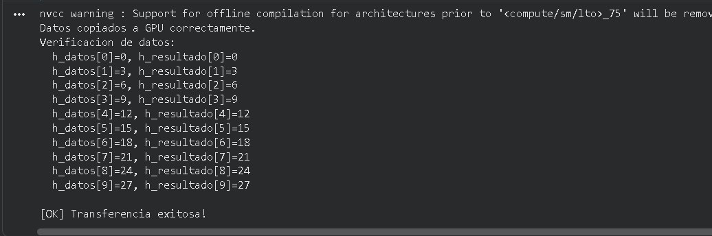

# Ejercicio 1 — Hola GPU: Mi primer programa CUDA

Categoría: CPU → GPU → CPU (Básico)

## Descripción

Este programa demuestra el ciclo más fundamental de CUDA: la transferencia bidireccional de datos entre la memoria del host (CPU) y la memoria del device (GPU). No se ejecuta ningún kernel — el objetivo es únicamente verificar que el flujo de comunicación entre los dos mundos funciona correctamente y que los datos llegan intactos en ambos sentidos.

### Flujo del programa

1. Se inicializa en CPU un arreglo h_datos de 10 enteros con múltiplos de 3 (`0, 3, 6, ..., 27`).
2. Se reserva memoria en la GPU para un arreglo del mismo tamaño con cudaMalloc.
3. Se copia el arreglo de CPU a GPU con cudaMemcpy y dirección cudaMemcpyHostToDevice.
4. Se copia de vuelta el arreglo de GPU a CPU (`cudaMemcpyDeviceToHost`) hacia un arreglo distinto h_resultado.
5. Se compara elemento por elemento h_datos contra h_resultado para verificar que la transferencia fue íntegra.
6. Se libera la memoria de GPU con cudaFree.

### Conceptos clave demostrados

- Convención de nombres: prefijo h_ para punteros en host y d_ para punteros en device.
- Reserva de memoria en GPU con cudaMalloc((void**)&d_ptr, bytes).
- Transferencia de memoria con cudaMemcpy en ambas direcciones.
- Liberación de memoria con cudaFree.

## Comandos

Ejecutado en Google Colab con GPU T4 (compute capability 7.5).

### Compilación

!nvcc ejercicio1_hola_gpu.cu -o ejercicio1
!./ejercicio1

### Ejecución

!./ejercicio1

## Salida

