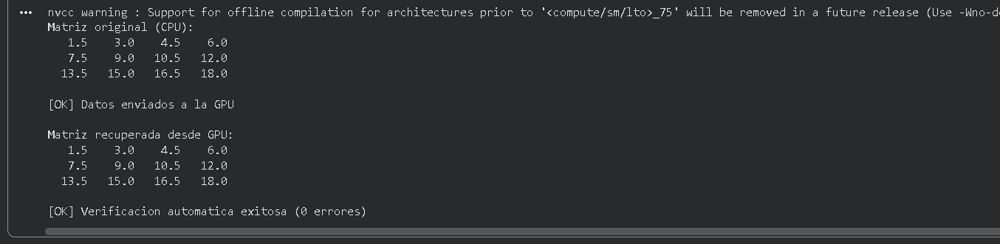

# Ejercicio 2 — Copia de Matriz 2D CPU ↔ GPU

**Categoría:** CPU → GPU → CPU (Transferencia 2D)

## Descripción

Este programa transfiere una matriz 2D de `3×4` floats entre la memoria del host y la del device. La GPU no realiza ningún cálculo: solo almacena los datos. El objetivo es aprender a calcular correctamente el tamaño en bytes para arreglos multidimensionales y a representar una matriz 2D como un arreglo lineal 1D en memoria, que es la práctica estándar en CUDA.

### Flujo del programa

1. Se declara en CPU una matriz `h_original` de `FILAS * COLS = 12` floats, almacenada como un arreglo 1D contiguo.
2. Se inicializa con valores `(i + 1) * 1.5` para tener datos fácilmente verificables.
3. Se imprime la matriz original usando la fórmula de indexación `m[i * cols + j]` para acceder al elemento `(i, j)`.
4. Se reserva memoria en la GPU con `cudaMalloc` (tamaño total = `FILAS * COLS * sizeof(float)`).
5. Se copia la matriz al device con `cudaMemcpy` (Host → Device).
6. Se copia la matriz de regreso al host hacia un arreglo distinto `h_recuperada`.
7. Se imprime la matriz recuperada para comparación visual.
8. Se hace una verificación automática elemento por elemento usando `fabsf(a - b) < 1e-5f` (tolerancia apropiada para floats, ya que la comparación directa con `==` no es confiable en punto flotante).
9. Se libera la memoria de GPU.

### Conceptos clave demostrados

- Representación de matrices 2D como arreglos 1D lineales con la fórmula `idx = i * cols + j` (row-major order).
- Cálculo correcto del tamaño en bytes para arreglos multidimensionales.
- Verificación automática con tolerancia para datos de tipo `float`.

## Comandos

Ejecutado en Google Colab con GPU T4 (compute capability 7.5).

### Compilación
```bash
nvcc ejercicio2_matriz.cu -o ejercicio2
```

### Ejecución
```bash
./ejercicio2
```

## Salida esperada
Matriz original (CPU):
1.5    3.0    4.5    6.0
7.5    9.0   10.5   12.0
13.5   15.0   16.5   18.0
[OK] Datos enviados a la GPU
Matriz recuperada desde GPU:
1.5    3.0    4.5    6.0
7.5    9.0   10.5   12.0
13.5   15.0   16.5   18.0
[OK] Verificacion automatica exitosa (0 errores)

## TAREA resuelta

> **Modifica el programa para verificar automáticamente que cada elemento de `h_original == h_recuperada`. Pista: usa un bucle y compara con `fabsf(a - b) < 1e-5f`.**

Se agregó un bucle de verificación al final del `main` que recorre cada elemento de ambos arreglos y compara la diferencia absoluta contra una tolerancia de `1e-5f`. Si encuentra discrepancias, las imprime indicando posición y valores; al final imprime el número total de errores. Se usa `fabsf` (de `<math.h>`) en lugar de `==` porque la comparación directa de floats no es confiable: errores de representación pueden hacer que dos valores "iguales" difieran en el último bit. En este caso, como la GPU solo almacena los bytes sin operar sobre ellos, los datos vuelven idénticos y el contador de errores debe ser `0`.



