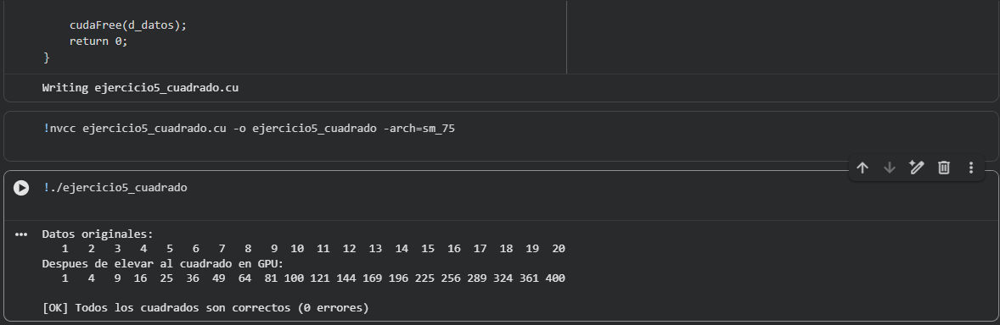

# Ejercicio 5 — Cuadrado de Elementos (In-place)

**Categoría:** Kernels Básicos GPU

## Descripción

Este programa eleva al cuadrado cada elemento de un arreglo de 20 enteros directamente en la GPU usando una operación **in-place**: el resultado se escribe sobre el mismo arreglo de entrada, sin necesidad de un buffer auxiliar de salida. Este patrón es muy común en CUDA cuando se quiere ahorrar memoria de VRAM, y se puede aplicar siempre que cada hilo opere únicamente sobre **su propio** elemento (no leyendo elementos vecinos), evitando así condiciones de carrera.

### Flujo del programa

1. Se inicializa en CPU un arreglo `h_datos` con los enteros del `1` al `20`.
2. Se imprime el arreglo original.
3. Se reserva memoria en GPU y se copia el arreglo al device.
4. Se lanza el kernel `cuadradoInPlace` con configuración `<<<1, 20>>>`: un solo bloque con 20 hilos, uno por elemento.
5. Cada hilo lee `d_datos[idx]`, lo eleva al cuadrado y lo escribe de vuelta en la **misma posición**: `d_datos[idx] = d_datos[idx] * d_datos[idx]`.
6. Se sincroniza la GPU y se transfiere el resultado de vuelta al **mismo arreglo** `h_datos` en CPU (también es una operación in-place desde el punto de vista del host).
7. Se imprime el arreglo modificado y se verifica automáticamente que cada elemento sea igual a `(i+1)²`.

### Conceptos clave demostrados

- **Operación in-place en GPU**: el mismo puntero `d_datos` se usa como entrada y salida del kernel. Esto reduce el consumo de memoria VRAM y elimina una `cudaMemcpy` adicional.
- **Configuración con un solo bloque**: como `N = 20 ≤ 1024` (límite de hilos por bloque en la T4), basta con un único bloque de 20 hilos. No hay necesidad de calcular `numBloques`.
- **Seguridad de la operación in-place**: el patrón es seguro porque cada hilo solo lee y escribe en su propio `idx`. No habría condición de carrera ni siquiera si dos hilos diferentes accedieran simultáneamente al arreglo, porque sus índices nunca coinciden.

### Comparación con la versión "out-of-place"

| Versión | Lectura | Escritura | Buffers en VRAM |
|---------|---------|-----------|-----------------|
| Out-of-place (ej. 4) | `d_A[idx]`, `d_B[idx]` | `d_C[idx]` | 3 vectores |
| In-place (este ej.) | `d_datos[idx]` | `d_datos[idx]` | 1 vector |

## Comandos

Ejecutado en Google Colab con GPU T4 (compute capability 7.5).

### Compilación
```bash
nvcc ejercicio5_cuadrado.cu -o ejercicio5_cuadrado -arch=sm_75
```

### Ejecución
```bash
./ejercicio5_cuadrado
```

## TAREA resuelta

> **Verifica que cada elemento es igual a `(i+1)²`. Imprime si hay algún error.**

Se añadió un bucle de verificación al final del `main` que recorre las 20 posiciones del arreglo y compara cada valor `h_datos[i]` contra el valor esperado `(i+1) * (i+1)`. Si encuentra una discrepancia, imprime la posición, el valor obtenido y el valor esperado. Al final reporta el conteo total de errores. Como la GPU ejecutó la operación correctamente sobre cada elemento, el contador queda en `0` y la salida confirma que `1²=1, 2²=4, 3²=9, ..., 20²=400`.

## Evidencia

