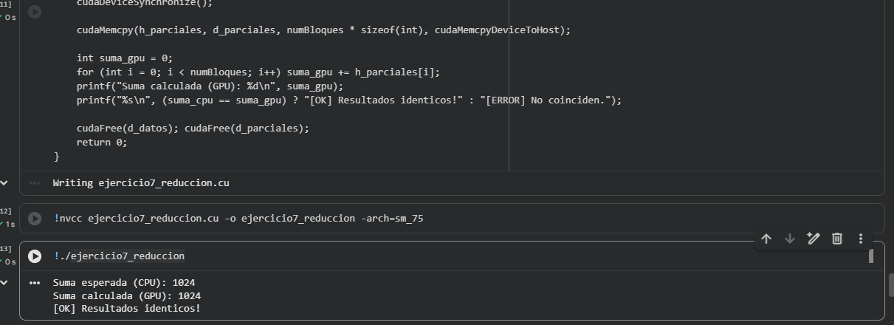

# Ejercicio 7 — Reducción Paralela: Suma de un Arreglo con Shared Memory

**Categoría:** Intermedio — Shared Memory y Reducción

## Descripción

Este programa implementa la **reducción paralela**: la operación de combinar todos los elementos de un arreglo en un único valor (en este caso, una suma). La reducción es uno de los patrones más importantes y reutilizables en computación paralela, y aparece en infinidad de aplicaciones: cálculo de normas, sumas acumuladas, productos punto, máximos, mínimos, varianzas, etc.

El kernel utiliza **shared memory** (memoria compartida por bloque, ~100× más rápida que la memoria global) y **sincronización intra-bloque** con `__syncthreads()` para coordinar los hilos en cada paso de la reducción.

### Flujo del programa

1. Se inicializa un arreglo `h_datos` de `N = 1024` enteros, todos con valor `1` (suma esperada = `1024`). Se calcula la suma en CPU como referencia.
2. Se lanza el kernel con `4 bloques × 256 hilos` y un tercer argumento `<<<bloques, hilos, sharedBytes>>>` que especifica el tamaño de shared memory dinámica por bloque.
3. **Dentro del kernel**, cada bloque ejecuta su propia reducción local sobre sus 256 elementos:
   - Cada hilo carga su elemento de memoria global a shared memory (`s_datos[tid] = d_entrada[idx]`).
   - Se sincronizan todos los hilos del bloque con `__syncthreads()`.
   - Se realiza la reducción en pasos sucesivos: en cada paso, la mitad activa de los hilos suma su valor con el del hilo a `stride` posiciones de distancia. El `stride` empieza en `blockDim.x/2 = 128` y se va dividiendo a la mitad hasta llegar a `1`.
   - Al final, `s_datos[0]` contiene la suma de los 256 elementos del bloque.
   - El hilo 0 escribe ese resultado parcial en `d_salida[blockIdx.x]`.
4. La CPU recibe los `4` resultados parciales (uno por bloque) y los suma para obtener el total final.

### Conceptos clave demostrados

- **Shared memory dinámica**: se declara con `extern __shared__ int s_datos[]` dentro del kernel y se le pasa el tamaño en el tercer argumento de `<<<...>>>`. Esto la diferencia de la shared memory estática (`__shared__ int s[256]`), cuyo tamaño debe ser constante en tiempo de compilación.
- **Sincronización intra-bloque con `__syncthreads()`**: es **crucial** colocarla después de cada paso de reducción. Sin ella, hilos podrían leer datos antes de que otros los hayan escrito, produciendo resultados incorrectos.
- **Reducción en árbol binario**: en cada paso se descarta la mitad de los hilos activos, dividiendo el trabajo restante por dos.
- **Hierarchical reduction (reducción por niveles)**: la GPU realiza una reducción local por bloque, y la CPU completa la reducción final sobre los resultados parciales. Esto evita la necesidad de sincronización entre bloques (que CUDA no soporta dentro de un mismo kernel).

### Configuración del lanzamiento

| Parámetro | Valor |
|-----------|-------|
| Tamaño del problema (`N`) | 1,024 elementos |
| Hilos por bloque | 256 |
| Número de bloques | 4 |
| Shared memory por bloque | `256 × 4 = 1,024 bytes` |
| Pasos de reducción por bloque | 8 (`log₂ 256`) |
| Reducción final en CPU | suma de 4 parciales |

### ¿Por qué shared memory y no memoria global?

| Tipo de memoria | Latencia aproximada |
|------------------|---------------------|
| Registros | ~1 ciclo |
| Shared memory | ~5 ciclos |
| Memoria global | ~200–800 ciclos |

Hacer la reducción directamente sobre memoria global sería 100× más lento. La shared memory permite que los 256 hilos del bloque accedan rápidamente a un buffer común durante los 8 pasos del algoritmo.

## Comandos

Ejecutado en Google Colab con GPU T4 (compute capability 7.5).

### Compilación
```bash
nvcc ejercicio7_reduccion.cu -o ejercicio7_reduccion -arch=sm_75
```

### Ejecución
```bash
./ejercicio7_reduccion
```

## Salida esperada
Suma esperada (CPU): 1024
Suma calculada (GPU): 1024
[OK] Resultados identicos!

## Evidencia



