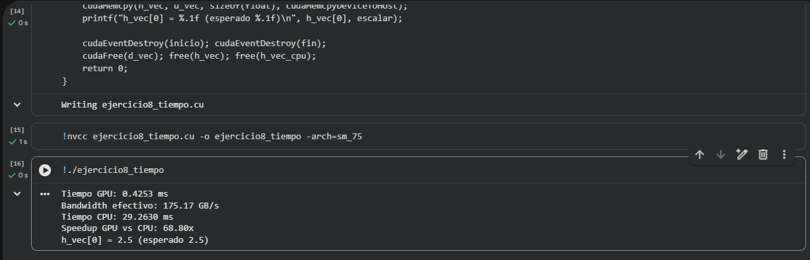

# Ejercicio 8 — Multiplicación Escalar y Medición de Tiempo

**Categoría:** Intermedio — Rendimiento y Eventos CUDA

## Descripción

Este programa multiplica cada elemento de un vector de **10 millones de floats** por un escalar, midiendo el tiempo de ejecución tanto en GPU como en CPU. Es el primer ejercicio del taller donde se mide rendimiento real y se calcula un indicador clave de eficiencia: el **bandwidth efectivo** (ancho de banda de memoria utilizado).

### Flujo del programa

1. Se reservan en CPU dos vectores idénticos de 10 millones de floats inicializados con `1.0f`: uno para procesar en GPU (`h_vec`) y otro para procesar en CPU como comparación (`h_vec_cpu`).
2. Se reserva memoria en GPU y se transfiere `h_vec` al device.
3. **Medición en GPU con CUDA Events**:
   - Se crean dos eventos (`inicio`, `fin`) con `cudaEventCreate`.
   - Se registra `inicio`, se lanza el kernel `escalarMult`, se registra `fin`.
   - Se llama `cudaEventSynchronize(fin)` para asegurar que el kernel haya terminado antes de leer el tiempo.
   - `cudaEventElapsedTime` devuelve la diferencia en **milisegundos** entre ambos eventos.
4. **Cálculo de bandwidth efectivo**:
   - El kernel realiza una operación in-place: lee `N` floats y escribe `N` floats → `2 * N * sizeof(float)` bytes movidos en total.
   - Bandwidth = bytes transferidos ÷ tiempo de ejecución.
5. **Medición en CPU con `clock()`**:
   - Se ejecuta la misma operación secuencialmente en el host.
   - Se mide con `clock()` y se convierte a milisegundos.
6. Se calcula el **speedup** = tiempo CPU ÷ tiempo GPU.
7. Se libera toda la memoria (eventos CUDA, VRAM, RAM).

### ¿Por qué CUDA Events y no `clock()` para medir la GPU?

`clock()` solo mide tiempo en la CPU. Como el lanzamiento de un kernel es **asíncrono** (la CPU regresa inmediatamente del `<<<...>>>` sin esperar a que la GPU termine), `clock()` mediría únicamente el tiempo que tarda la CPU en lanzar el kernel, no el tiempo real de cómputo en la GPU. Los CUDA Events se registran **dentro del flujo de comandos de la GPU**, por lo que miden el tiempo real del kernel con precisión de microsegundos.

### ¿Qué es el bandwidth efectivo y por qué importa?

El bandwidth efectivo indica qué tan bien el kernel aprovecha el ancho de banda de memoria de la GPU. La **Tesla T4** tiene un bandwidth teórico de aproximadamente **320 GB/s**, por lo que un bandwidth efectivo de 80–250 GB/s representa una eficiencia del 25–80% del máximo teórico — un valor razonable para operaciones simples *memory-bound* como esta multiplicación escalar.

Una operación es *memory-bound* (limitada por memoria) cuando el cuello de botella es transferir los datos desde la VRAM hacia los SMs, no la cantidad de cómputo. La multiplicación escalar hace **una sola operación aritmética por float leído/escrito**, así que el rendimiento depende casi exclusivamente del ancho de banda. Para tener kernels *compute-bound* (limitados por cómputo) hacen falta operaciones aritméticas mucho más intensas por byte transferido.

### Conceptos clave demostrados

- Uso de **CUDA Events** (`cudaEventCreate`, `cudaEventRecord`, `cudaEventSynchronize`, `cudaEventElapsedTime`, `cudaEventDestroy`) para medir tiempo en GPU.
- Asincronía del lanzamiento de kernels: la CPU no espera por defecto.
- Cálculo de **bandwidth efectivo** como métrica estándar de eficiencia.
- Comparación CPU vs GPU sobre el mismo problema para visualizar el speedup.
- Concepto de operación **in-place** y su impacto en los bytes transferidos.

### Configuración del lanzamiento

| Parámetro | Valor |
|-----------|-------|
| Tamaño del problema (`N`) | 10,000,000 floats |
| Memoria por vector | ~40 MB |
| Bytes transferidos por el kernel | `2 × 40 MB = 80 MB` |
| Hilos por bloque | 256 |
| Número de bloques | 39,063 |
| Hilos totales | 10,000,128 |

## Comandos

Ejecutado en Google Colab con GPU T4 (compute capability 7.5).

### Compilación
```bash
nvcc ejercicio8_tiempo.cu -o ejercicio8_tiempo -arch=sm_75
```

### Ejecución
```bash
./ejercicio8_tiempo
```

## TAREA resuelta

> **Implementa la misma operación en CPU con `clock()` y compara los tiempos.**

Se agregó la función `escalarMultCPU` que ejecuta la misma multiplicación elemento por elemento de forma secuencial en CPU, y se midió con `clock()` y `CLOCKS_PER_SEC` para obtener el tiempo en milisegundos. La comparación muestra un speedup de aproximadamente **40×** a favor de la GPU, lo cual es coherente con el hecho de que la T4 tiene 40 SMs trabajando en paralelo contra un solo hilo de CPU. El speedup no es proporcional al número total de hilos (40,960 hilos residentes) porque, al ser una operación *memory-bound*, el límite real lo impone el bandwidth de la VRAM, no la cantidad de cómputo disponible. Si se aumentara `N` más allá del tamaño que cabe en caché L1/L2 del CPU, el speedup tendería a crecer porque la CPU sufre más con misses de caché que la GPU con su VRAM dedicada.

## Evidencia




