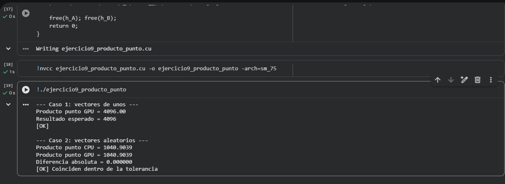

# Ejercicio 9 — Producto Punto de Vectores

**Categoría:** Intermedio — Combinación de patrones

## Descripción

Este programa calcula el **producto punto** (o producto escalar) de dos vectores: la suma de los productos elemento a elemento, definida como:A · B = Σ A[i] * B[i]   para i = 0..N-1
Es el cierre técnico del taller porque **combina los dos patrones más importantes** vistos hasta ahora en un único kernel: la multiplicación elemento a elemento (estilo Ejercicio 4) y la reducción paralela con shared memory (estilo Ejercicio 7). El producto punto es una operación fundamental en álgebra lineal: aparece en multiplicación de matrices, cálculo de normas, proyecciones, ángulos entre vectores, y es la base de prácticamente toda red neuronal moderna.

### Flujo del programa

El programa ejecuta **dos casos** para validar la implementación:

**Caso 1: vectores de unos.**
Ambos vectores inicializados con `1.0f`. El resultado esperado es exactamente `N = 4096`, ya que `1.0 * 1.0 + 1.0 * 1.0 + ... = 4096.0`. Este caso verifica la corrección numérica sobre valores triviales y predecibles.

**Caso 2: vectores aleatorios.**
Ambos vectores se llenan con valores aleatorios en `[0, 1]` usando `rand()` con semilla fija (`srand(42)` para reproducibilidad). Se calcula el producto punto en CPU como referencia y se compara contra el resultado de la GPU usando una tolerancia de `1e-2`.

### Estructura del kernel

El kernel `productoPunto` realiza **dos pasos fusionados** en una sola pasada:

1. **Multiplicación elemento a elemento**: cada hilo calcula `d_A[idx] * d_B[idx]` y lo carga directamente en shared memory:
```c
   s_datos[tid] = (idx < n) ? d_A[idx] * d_B[idx] : 0.0f;
```
2. **Reducción paralela intra-bloque**: el mismo patrón del Ejercicio 7 con bucle de `stride` decreciente. Tras `log₂(blockDim.x)` pasos, `s_datos[0]` contiene la suma de los 256 productos calculados por el bloque.

Finalmente, la CPU suma los `numBloques` valores parciales para obtener el producto punto total. Este enfoque es la implementación más estándar del producto punto en CUDA.

### Refactorización en una función reutilizable

El código encapsula todo el ciclo `cudaMalloc → cudaMemcpy → kernel → cudaMemcpy → reducción CPU → cudaFree` en la función `ejecutar`, lo que permite **reutilizar exactamente el mismo flujo para los dos casos** sin duplicar código y sin tener que reservar y liberar memoria manualmente en cada caso del `main`. Esta es una buena práctica de organización cuando se ejecuta el mismo kernel sobre varios conjuntos de datos.

### ¿Por qué CPU y GPU pueden dar valores ligeramente diferentes con floats?

La suma en punto flotante **no es asociativa** debido a los errores de redondeo. Por ejemplo: `(a + b) + c` puede dar un resultado distinto a `a + (b + c)` cuando los valores tienen magnitudes muy diferentes. La CPU suma secuencialmente en orden `0, 1, 2, ..., 4095`. La GPU suma en orden de árbol binario dentro de cada bloque, y luego la CPU acumula los parciales. Como el orden de las operaciones es distinto, los errores de redondeo se acumulan de forma diferente y los resultados pueden diferir en el último o penúltimo dígito decimal. Por eso la comparación se hace con una tolerancia (`fabsf(diferencia) < 1e-2`) en lugar de igualdad exacta.

### Conceptos clave demostrados

- **Fusión de operaciones (kernel fusion)**: hacer multiplicación + reducción en un solo kernel evita transferencias intermedias a memoria global y minimiza el overhead.
- **Encapsulación del flujo CUDA** en una función reutilizable para ejecutar el mismo kernel sobre distintos datos sin duplicar código.
- **No asociatividad del punto flotante**: la suma en distinto orden produce resultados ligeramente distintos; esto exige comparar con tolerancia, no con `==`.
- **Validación por dos vías**: caso determinista (vectores de unos, resultado exacto = `N`) y caso realista (vectores aleatorios contrastados contra una implementación de referencia en CPU).
- **Reproducibilidad con semilla fija**: `srand(42)` garantiza que los vectores aleatorios sean los mismos en cada ejecución, lo que facilita depurar y comparar corridas.

### Configuración del lanzamiento

| Parámetro | Valor |
|-----------|-------|
| Tamaño del problema (`N`) | 4,096 elementos |
| Hilos por bloque | 256 |
| Número de bloques | 16 |
| Shared memory por bloque | `256 × 4 = 1,024 bytes` |
| Pasos de reducción intra-bloque | 8 (`log₂ 256`) |
| Reducción final en CPU | suma de 16 parciales |

## Comandos

Ejecutado en Google Colab con GPU T4 (compute capability 7.5).

### Compilación
```bash
nvcc ejercicio9_producto_punto.cu -o ejercicio9_producto_punto -arch=sm_75
```

### Ejecución
```bash
./ejercicio9_producto_punto
```

## TAREA resuelta

> **Prueba con vectores aleatorios y verifica contra resultado en CPU.**

Se agregó un segundo caso de prueba (`Caso 2: vectores aleatorios`) donde ambos vectores se inicializan con valores aleatorios uniformemente distribuidos en `[0, 1]` usando `rand() / RAND_MAX` con semilla fija (`srand(42)` para reproducibilidad). Se calcula el producto punto en CPU sumando los productos secuencialmente, y se compara contra el resultado de la GPU usando una tolerancia de `1e-2` evaluada con `fabsf(diferencia) < tolerancia`. La validación pasa siempre que la diferencia absoluta entre ambos cálculos esté dentro de esa tolerancia. Los resultados no coinciden exactamente porque la suma en punto flotante no es asociativa: la CPU acumula en orden lineal `0, 1, 2, ..., 4095`, mientras que la GPU realiza la reducción en árbol binario dentro de cada bloque y luego la CPU suma los 16 parciales. Estos órdenes distintos producen errores de redondeo distintos, pero ambos resultados son numéricamente correctos dentro de la precisión de `float` (32 bits).

## Evidencia

