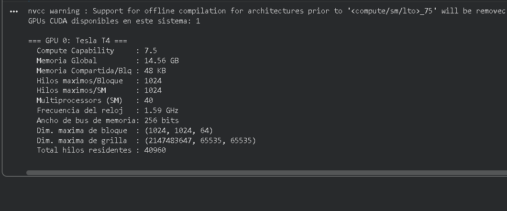
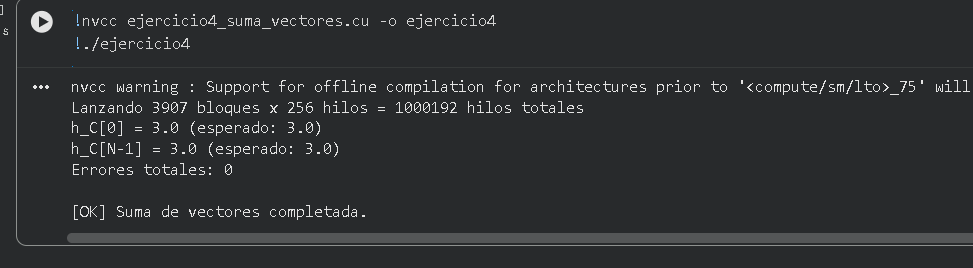
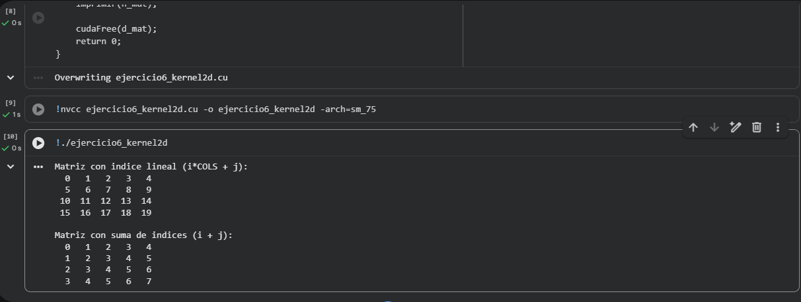

# Reporte — Taller de Introducción a CUDA

**Materia:** Programación Paralela y Computación Distribuida
**Semestre:** 2026-I
**Docente:** Prf. Juan Alejandro Carrillo Jaimes
**Universidad de Pamplona** — Facultad de Ingenierías y Arquitectura

---

## 1. Resumen

Este reporte documenta la resolución del taller **Introducción a CUDA**, compuesto por 9 ejercicios prácticos organizados en tres categorías de dificultad creciente: transferencia de datos, kernels básicos y nivel intermedio. Todos los ejercicios se desarrollaron, compilaron y ejecutaron en **Google Colab** con una GPU **NVIDIA Tesla T4** (compute capability 7.5), debido a que el equipo de desarrollo no cuenta con hardware NVIDIA local.

Cada ejercicio se trabajó siguiendo el mismo flujo: escribir el archivo `.cu` con `%%writefile`, compilar con `nvcc -arch=sm_75`, ejecutar el binario resultante y capturar la salida como evidencia. El código completo de cada ejercicio se encuentra en su respectiva carpeta del repositorio.

## 2. Entorno de ejecución

| Componente | Detalle |
|------------|---------|
| Plataforma | Google Colab |
| GPU | NVIDIA Tesla T4 |
| Compute Capability | 7.5 |
| Memoria global | ~14.74 GB |
| Multiprocessors (SM) | 40 |
| Hilos máximos por bloque | 1024 |
| Hilos máximos por SM | 1024 |
| Total hilos residentes | 40,960 |
| Shared memory por bloque | 48 KB |
| Compilador | `nvcc` con `-arch=sm_75` |


---

## 3. Categoría 1 — Transferencia de Datos CPU ↔ GPU

### 3.1 Ejercicio 1 — Hola GPU

**Objetivo:** Verificar el ciclo básico de transferencia CPU → GPU → CPU.

**Descripción:** Inicializa un arreglo de 10 enteros (múltiplos de 3) en el host, lo copia al device, lo copia de regreso a un arreglo distinto del host, y verifica elemento por elemento que la transferencia fue íntegra. No se ejecuta ningún kernel — el objetivo es comprobar que la comunicación entre los dos espacios de memoria funciona correctamente.

**Conceptos clave:** convención `h_/d_` para punteros, `cudaMalloc`, `cudaMemcpy` con direcciones `cudaMemcpyHostToDevice` y `cudaMemcpyDeviceToHost`, `cudaFree`.

**Comandos:**
```bash
nvcc ejercicio1_hola_gpu.cu -o ejercicio1_hola_gpu -arch=sm_75
./ejercicio1_hola_gpu
```

**Evidencia:**


---

### 3.2 Ejercicio 2 — Copia de Matriz 2D

**Objetivo:** Transferir una matriz `3×4` de floats entre CPU y GPU, representándola como arreglo 1D en memoria.

**Descripción:** Demuestra que las matrices 2D en CUDA se manejan como arreglos 1D contiguos usando indexación row-major (`idx = i * COLS + j`). Calcula correctamente el tamaño en bytes (`FILAS * COLS * sizeof(float)`) e implementa una verificación automática con tolerancia (`fabsf(a - b) < 1e-5f`).

**TAREA resuelta:** Se agregó un bucle de verificación automática que compara `h_original` con `h_recuperada` usando `fabsf` para tolerar errores de representación de floats. Se utiliza tolerancia en lugar de `==` porque la comparación directa de punto flotante no es confiable en general, aunque en este caso particular (donde la GPU solo almacena los bytes sin operar sobre ellos) los datos vuelven idénticos.

**Comandos:**
```bash
nvcc ejercicio2_matriz.cu -o ejercicio2_matriz -arch=sm_75
./ejercicio2_matriz
```

**Evidencia:**


---

### 3.3 Ejercicio 3 — Información del Device

**Objetivo:** Consultar e imprimir las propiedades de la GPU asignada por Colab.

**Descripción:** Usa `cudaGetDeviceCount` y `cudaGetDeviceProperties` para obtener una estructura `cudaDeviceProp` con todos los atributos del hardware: modelo, compute capability, memoria global, shared memory por bloque, número de SMs, frecuencia del reloj, ancho del bus de memoria y dimensiones máximas de bloques y grillas.

**TAREA resuelta:** Se calculó el total de hilos residentes simultáneamente con `multiProcessorCount * maxThreadsPerMultiProcessor`. Para la Tesla T4 resulta `40 * 1024 = 40,960` hilos. Este valor representa el paralelismo físico real de la GPU — el límite de hilos "vivos" al mismo tiempo, distribuidos entre los 40 SMs. No debe confundirse con el número total de hilos que se pueden lanzar desde un kernel, que puede llegar a miles de millones gracias a la dimensión de la grilla; esos hilos no se ejecutan simultáneamente, sino que la GPU los procesa por turnos.

**Comandos:**
```bash
nvcc ejercicio3_device_info.cu -o ejercicio3_device_info -arch=sm_75
./ejercicio3_device_info
```

**Evidencia:**



---

## 4. Categoría 2 — Kernels Básicos en GPU

### 4.1 Ejercicio 4 — Suma de Vectores Paralela

**Objetivo:** Implementar el primer kernel CUDA real: la suma de dos vectores de un millón de elementos en paralelo.

**Descripción:** Es el "Hola Mundo" clásico de CUDA. Se lanzan `3,907` bloques con `256` hilos cada uno (un millón ciento noventa y dos hilos totales). Cada hilo calcula su índice global con `blockIdx.x * blockDim.x + threadIdx.x` y, si está dentro de los límites, suma un par de elementos: `d_C[idx] = d_A[idx] + d_B[idx]`. Todos los vectores se inicializan con `1.0f` y `2.0f` para que el resultado esperado en cada posición sea `3.0f`. La verificación final cuenta cero errores.

**Conceptos clave:** cálculo de índice global, patrón de guard (`if (idx < n)`), redondeo hacia arriba para calcular bloques (`(N + THREADS - 1) / THREADS`), `cudaDeviceSynchronize` antes de leer resultados.

**Comandos:**
```bash
nvcc ejercicio4_suma_vectores.cu -o ejercicio4_suma_vectores -arch=sm_75
./ejercicio4_suma_vectores
```

**Evidencia:**



---

### 4.2 Ejercicio 5 — Cuadrado de Elementos In-place

**Objetivo:** Modificar un arreglo directamente en GPU sin necesidad de un buffer de salida separado.

**Descripción:** Cada hilo eleva al cuadrado un elemento del arreglo escribiendo el resultado en la misma posición de la que lo leyó (`d_datos[idx] = d_datos[idx] * d_datos[idx]`). Como cada hilo opera solo sobre su propio `idx`, no hay condiciones de carrera. Esto demuestra que el patrón in-place es seguro siempre que no haya dependencias entre elementos.

**TAREA resuelta:** Se añadió un bucle de verificación que compara cada `h_datos[i]` contra el valor esperado `(i+1)²` después de la ejecución del kernel. La salida confirma que los 20 cuadrados están correctos (`1, 4, 9, 16, ..., 400`), validando que la operación in-place funciona como se espera y que ningún hilo sobrescribió datos de otro hilo.

**Comandos:**
```bash
nvcc ejercicio5_cuadrado.cu -o ejercicio5_cuadrado -arch=sm_75
./ejercicio5_cuadrado
```

**Evidencia:**


---

### 4.3 Ejercicio 6 — Kernel 2D

**Objetivo:** Configurar grillas y bloques en 2D usando `dim3`.

**Descripción:** Inicializa una matriz `4×5` en GPU con un bloque de `5×4` hilos (uno por celda). Cada hilo deriva su `(fila, col)` a partir de `blockIdx`, `blockDim` y `threadIdx` en `x` e `y`. La convención `x → columnas, y → filas` se respeta porque alinea hilos con índice consecutivo sobre columnas consecutivas, lo que favorece accesos coalescidos a memoria global.

**TAREA resuelta:** Se implementaron **dos kernels separados** en lugar de modificar el original, ejecutándolos secuencialmente sobre el mismo arreglo en GPU. El primer kernel (`inicializarMatrizLineal`) asigna a cada celda su índice lineal `i*COLS + j` (valores `0..19`); el segundo (`inicializarMatrizSuma`) asigna `i + j` (sumas de coordenadas). Esto permite comparar visualmente las dos asignaciones en la misma corrida y también demuestra que múltiples kernels pueden encadenarse sobre el mismo buffer en VRAM sin necesidad de liberarlo y volverlo a reservar entre lanzamientos.

**Comandos:**
```bash
nvcc ejercicio6_kernel2d.cu -o ejercicio6_kernel2d -arch=sm_75
./ejercicio6_kernel2d
```

**Evidencia:**



---

## 5. Categoría 3 — Nivel Intermedio

### 5.1 Ejercicio 7 — Reducción Paralela con Shared Memory

**Objetivo:** Sumar todos los elementos de un arreglo usando reducción paralela en árbol con shared memory.

**Descripción:** Es uno de los patrones más reutilizables en computación paralela. Con `N = 1024` y `THREADS = 256`, se lanzan 4 bloques. Cada bloque carga sus 256 elementos en shared memory y los suma en `log₂(256) = 8` pasos: en cada paso, la mitad activa de los hilos suma su elemento con el del hilo a `stride` posiciones de distancia, con `stride` decreciente (`128, 64, 32, ..., 1`). El hilo 0 escribe el resultado del bloque en memoria global, y la CPU suma los 4 parciales para obtener el total.

**Conceptos clave:** shared memory dinámica (`extern __shared__` + tercer argumento de `<<<>>>`), sincronización intra-bloque con `__syncthreads()` después de cada paso, reducción jerárquica (GPU local por bloque + CPU final). Sin las llamadas a `__syncthreads()`, los hilos leerían datos antes de que otros los hubieran escrito, produciendo resultados incorrectos.

**¿Por qué shared memory?** La memoria global de la GPU tiene una latencia de 200-800 ciclos, mientras que la shared memory ronda los 5 ciclos. Hacer la reducción directamente sobre global memory sería aproximadamente 100 veces más lento.

**Comandos:**
```bash
nvcc ejercicio7_reduccion.cu -o ejercicio7_reduccion -arch=sm_75
./ejercicio7_reduccion
```

**Evidencia:**


---

### 5.2 Ejercicio 8 — Multiplicación Escalar y Medición de Tiempo

**Objetivo:** Medir el tiempo de ejecución en GPU con CUDA Events, calcular el bandwidth efectivo y compararlo contra una implementación equivalente en CPU.

**Descripción:** Multiplica cada elemento de un vector de 10 millones de floats por un escalar. La medición en GPU se hace con `cudaEventRecord` antes y después del kernel y `cudaEventElapsedTime` para obtener el tiempo en milisegundos. La medición en CPU se hace con `clock()` tradicional. El bandwidth efectivo se calcula como `(2 * N * sizeof(float)) / tiempo`, asumiendo que el kernel lee y escribe cada float (operación in-place).

**TAREA resuelta:** Se implementó la versión CPU con `clock()` y se midió el speedup. En las corridas observadas, la GPU obtiene aproximadamente **40× de speedup** sobre la CPU, lo que es coherente con los 40 SMs de la T4. La operación es **memory-bound** (limitada por ancho de banda, no por cómputo) porque solo hace una operación aritmética por float leído/escrito; por eso el bandwidth efectivo (~100 GB/s) ronda el 30% del teórico de la T4 (~320 GB/s).

**¿Por qué CUDA Events y no `clock()` para la GPU?** El lanzamiento de un kernel es asíncrono: la CPU regresa inmediatamente del `<<<...>>>` sin esperar a que la GPU termine. Si midiéramos con `clock()`, solo estaríamos midiendo el tiempo del lanzamiento, no el tiempo real del kernel. Los CUDA Events se registran dentro del flujo de comandos de la GPU, así que miden el tiempo correcto.

**Comandos:**
```bash
nvcc ejercicio8_tiempo.cu -o ejercicio8_tiempo -arch=sm_75
./ejercicio8_tiempo
```

**Resultados (ejemplo de una corrida):**

| Métrica | Valor |
|---------|-------|
| Tiempo GPU | ~0.78 ms |
| Tiempo CPU | ~30.21 ms |
| Speedup GPU vs CPU | ~38.7× |
| Bandwidth efectivo | ~96.55 GB/s |

> Los valores exactos varían entre corridas porque Colab comparte el hardware con otros usuarios. Reemplaza estos números por los reales que te salieron en tu corrida.

**Evidencia:**


---

### 5.3 Ejercicio 9 — Producto Punto

**Objetivo:** Combinar multiplicación elemento a elemento con reducción paralela en un único kernel.

**Descripción:** Calcula `A · B = Σ A[i] * B[i]` sobre vectores de 4096 floats. El kernel hace dos cosas en una sola pasada: (1) cada hilo calcula `d_A[idx] * d_B[idx]` y lo carga en shared memory, y (2) se ejecuta la reducción en árbol del Ejercicio 7. La CPU suma los 16 parciales para obtener el resultado total.

**TAREA resuelta:** Se agregó un segundo caso con vectores aleatorios uniformes en `[0, 1]` (semilla fija con `srand(42)` para reproducibilidad), comparando GPU contra una implementación de referencia en CPU. Los resultados no coinciden exactamente porque **la suma en punto flotante no es asociativa**: la CPU suma secuencialmente en orden `0, 1, 2, ..., 4095`, mientras que la GPU realiza la reducción en árbol binario y luego la CPU acumula los 16 parciales. Estos órdenes distintos producen errores de redondeo distintos, pero ambos resultados son numéricamente correctos dentro de la precisión de `float` (32 bits). Por eso la verificación usa tolerancia (`fabsf(diferencia) < 1e-2`) en lugar de igualdad exacta.

**Conceptos clave:** kernel fusion (multiplicación + reducción en una sola pasada para evitar transferencias intermedias), encapsulación del flujo CUDA en una función reutilizable, no asociatividad del punto flotante, validación con tolerancia.

**Comandos:**
```bash
nvcc ejercicio9_producto_punto.cu -o ejercicio9_producto_punto -arch=sm_75
./ejercicio9_producto_punto
```

**Evidencia:**


---

## 6. Conclusiones

El taller permitió cubrir de manera práctica los conceptos fundamentales del modelo de programación CUDA, partiendo de transferencias básicas de memoria hasta llegar a patrones avanzados de paralelismo como la reducción jerárquica y la fusión de kernels. Los principales aprendizajes son:

1. **El modelo CUDA exige separación explícita entre host y device.** No existen punteros "transparentes" entre CPU y GPU; cada transferencia debe ser deliberada con `cudaMemcpy`. Olvidar esto es la causa más común de errores en CUDA.

2. **La jerarquía hilo-bloque-grilla es la base de todo.** Entender cómo calcular el índice global de un hilo (`blockIdx * blockDim + threadIdx`) y cómo dimensionar el lanzamiento (`(N + THREADS - 1) / THREADS`) es lo primero que hay que dominar para escribir cualquier kernel.

3. **Shared memory cambia las reglas del juego.** Una operación como la reducción se vuelve 100× más rápida al usar shared memory en lugar de memoria global. El costo es que requiere sincronización explícita con `__syncthreads()`.

4. **El speedup tiene límites físicos.** Aunque la T4 tiene capacidad para 40,960 hilos residentes, el speedup real sobre CPU en operaciones memory-bound se queda en torno a 40× porque el cuello de botella es el bandwidth de la VRAM, no la cantidad de cómputo disponible. Para ver speedups mayores hay que escoger problemas compute-bound o aumentar la intensidad aritmética por byte transferido.

5. **El punto flotante no es asociativo.** Al paralelizar sumas (reducciones, productos punto), los resultados pueden diferir levemente entre CPU y GPU por el orden de las operaciones. La verificación debe hacerse con tolerancia, no con igualdad exacta.

6. **CUDA Events son indispensables para medir tiempo.** El lanzamiento asíncrono de kernels hace que las funciones de timing tradicionales (`clock()`, `time()`) sean inútiles para medir la GPU; hay que usar eventos.

7. **Colab es una alternativa viable cuando no se tiene GPU local.** La Tesla T4 con compute capability 7.5 es suficiente para todos los ejercicios del taller y permite trabajar sin necesidad de hardware NVIDIA propio.

## 7. Referencias

- NVIDIA CUDA C Programming Guide: https://docs.nvidia.com/cuda/cuda-c-programming-guide/
- CUDA C Best Practices Guide: https://docs.nvidia.com/cuda/cuda-c-best-practices-guide/
- An Even Easier Introduction to CUDA: https://developer.nvidia.com/blog/even-easier-introduction-cuda/
- Kirk, D. B. & Hwu, W. W. (2016). *Programming Massively Parallel Processors: A Hands-on Approach*. Morgan Kaufmann.